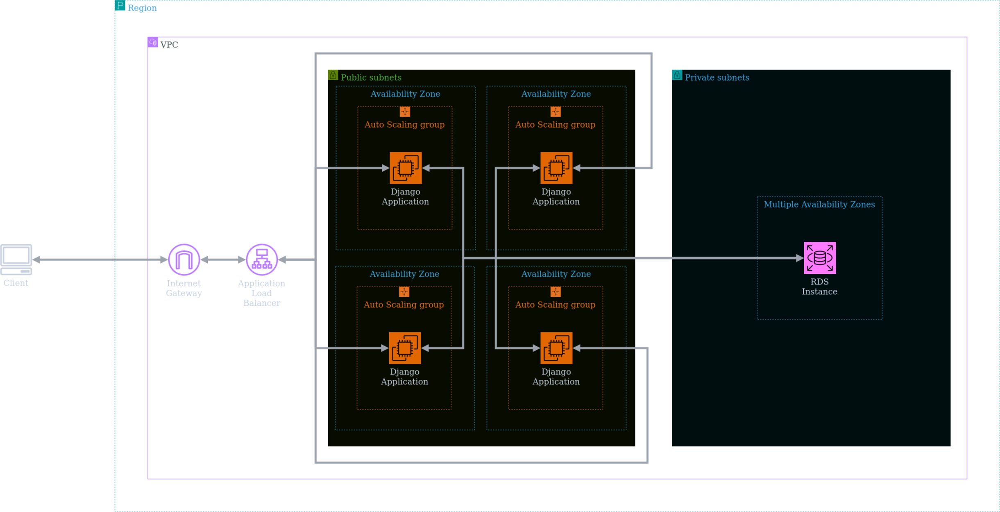

# Projeto de Computação em Nuvem

Projeto de implementação de um ALB entre instâncias EC2 com Auto Scaling e Banco de dados RDS

**Por: Renato Laffranchi Falcão**

## Objetivo de Implementação

1. Infraestrutura como Código (IaC) com Terraform.
2. Application Load Balancer (ALB).
3. EC2 com Auto Scaling.
4. Banco de Dados RDS.
5. Aplicação.
6. Análise de Custo com a Calculadora AWS.
7. Documentação.

### Setup do ambiente de desenvolvimento

O projeto foi desenvolvido em Terraform, uma ferramenta de desenvolvimento de infraestrutura como código (IaC), que gerencia instâncias e serviços de diversos provedores, como a AWS. O diretório do projeto está estruturado da seguinte forma:

    .
    ├── terraform/
    │   ├── main.tf
    │   ├── ec2.tf
    │   ├── rds.tf
    └────── outputs.tf

Nesta estrutura de diretórios, o arquivo **main.tf** contém ...

O arquivo **outputs.tf** contém ...

Antes de mais nada, é necessário realizar a instalação do Terraform. Para tanto, basta seguir o [tutorial de instalação do Terraform](https://developer.hashicorp.com/terraform/downloads) de acordo com o sistema operacional. Além do Terraform, também é preciso instalar a [CLI da AWS](https://aws.amazon.com/pt/cli/) de acordo com o sistema operacional. 

Por fim, deve-se configurar as credencias da AWS para que o Terraform realize todo o gerenciamento. A seguinte forma de fazer esta configuração é uma boa prática para evitar vazamento de credenciais caso os scripts sejam compartilhados. Utilizando o comando:

    aws configure

- `AWS Access Key ID` e `AWS Secret Access Key ID`: O **ID** e a **chave de acesso** gerados no console da AWS, na aba *"Credenciais de Segurança"*.
- `Default region name`: A região padrão para se implantar serviços e instâncias. Neste caso, está sendo utilizada a região **MUDAR A REGIÃO AQUI**.
- `Default output format`: O formato de saída padrão das respostas recebidas. Por simplicidade, **json**.

### Deploy do projeto

Rodar comandos do terraform para entrar na pasta e rodar o arquivo.

## Referências

AWS Architecture Blog. (2021). [What to Consider when Selecting a Region for your Workloads](https://aws.amazon.com/pt/blogs/architecture/what-to-consider-when-selecting-a-region-for-your-workloads/).

