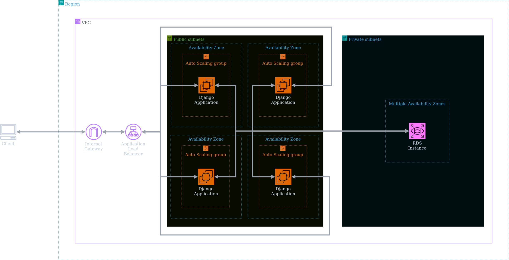

# Cloud Computing Project - 2023.2 [EN-US]

Project for the implementation of an ALB between EC2 instances with Auto Scaling and RDS Database

**By: Renato Laffranchi Falcão**

## Implementation Objective

1. Infrastructure as Code (IaC) with Terraform.
2. Application Load Balancer (ALB).
3. EC2 with Auto Scaling.
4. RDS Database.
5. Application.
6. Cost Analysis with the AWS Calculator.
7. Documentation.

### Technical Detailing

The project was developed in Terraform, a tool for infrastructure as code (IaC) development, managing instances and services from various providers, like AWS. The project directory is structured as follows:

    .
    ├── project/
    │   ├── main.tf
    │   ├── outputs.tf
    │   └── modules/
    │       ├── alb_listener/
    │       ├── alb_target_group/
    │       ├── application_load_balancer/
    │       ├── auto_scaling_group/
    │       ├── auto_scaling_policy/
    │       ├── cloud_watch_alarm/
    │       ├── internet_gateway/
    │       ├── launch_template/
    │       ├── placement_group/
    │       ├── relational_database/
    │       ├── route_table/
    │       ├── s3_bucket/
    │       ├── security_group/
    │       ├── subnet_group/
    │       ├── subnet_route_table_association/
    │       ├── subnets/
    │       └── vpc/
    ├── docs/
    │   └── cost-estimate.pdf
    ├── img/
    │   └── cloud-architecture.png
    └── deploy.sh

In this directory structure, all the Terraform code is inside the `project/` folder. The `main.tf` file contains the main connection between AWS resources, responsible for deploying the entire infrastructure. The `outputs.tf` file displays the application access URL through the browser to the user.

The `modules/` folder, also inside this directory, contains all the resources needed to deploy the application, separated by component. This modular organization is efficient for abstracting certain resource details and allowing reuse. All modules are used by the main program, with arguments passed to the modules facilitating resource connection and making the code easier to update and maintain.

Here are some important technical details about the provided Terraform code:

1. **Subnet Configuration**: The code defines two public and two private subnets, each in different availability zones. This not only distributes the load and improves resilience but also allows traffic segregation between public and private resources, like database instances and web servers.

2. **Security Groups and Rules**: Security groups are set up for different resources, like instances, load balancers, and databases. Defined rules allow specific traffic (e.g., HTTP, SSH, MySQL) from/to defined IP address blocks, ensuring only necessary and secure traffic is permitted, which is crucial for network security.

3. **Database Credential Management**: The database username and password are managed through variables, suggesting a secure and centralized method of credential management, essential for database security and maintenance.

4. **Django Image Choice for Launch Template**: The selected AMI is specific to Django (Bitnami with Linux Debian 11 - x86-64), indicating an optimized, ready-to-use configuration for Django applications, ensuring efficiency and stability. The image also receives regular updates, always ensuring the latest stable version of all components.

5. **Auto Scaling Group**: Configuration of an auto scaling group to manage the dynamic scalability of EC2 instances in response to changes in demand or performance. Specifically, this scalability is triggered by high CPU usage, monitored through a CloudWatch alarm.

6. **Load Balancing (ALB)**: Implementation of an Application Load Balancer, helping to distribute incoming traffic to improve application availability and robustness.

7. **Monitoring and Alerts with CloudWatch**: Creation of a CloudWatch alarm to monitor CPU usage and trigger auto scaling policies, ensuring efficient resource management.

8. **S3 Storage**: Use of an S3 bucket for object storage, providing a secure and effective way to store and access data. In this case, the bucket is used to store the Terraform state.

These components together form a robust and scalable infrastructure in AWS, ideal for supporting modern web applications with complex network, security, and performance requirements.

### Infrastructure Deployment

Before deploying, it is necessary to install Terraform. Simply follow the [Terraform installation tutorial](https://developer.hashicorp.com/terraform/downloads) according to the operating system. In addition to Terraform, it is also necessary to install the [AWS CLI](https://aws.amazon.com/pt/cli/) according to the operating system.

With both dependencies installed, AWS credentials must be configured for Terraform to manage everything independently. One of the safest ways to manage AWS development credentials, to prevent leakage, is to set them as environment variables on the computer, so they are not shared. Using the

 command:

    aws configure

- `AWS Access Key ID` and `AWS Secret Access Key ID`: The **ID** and **access key** generated in the AWS console, under the *"Security Credentials"* tab.
- `Default region name`: The default region for deploying services and instances. It can be left blank, but the region being used is **us-west-2**.
- `Default output format`: The default output format for responses received. It can be left blank.

Finally, execute the following command in the root directory of this repository:

- Linux

        ./deploy.sh

> [!IMPORTANT]  
> The `deploy.sh` and `destroy.sh` scripts only work on Linux operating systems.

When running the command, two variables must be defined:

- `Database Username` and `Database Password`: The user and password, respectively, for database access.

Now just make some tea while waiting for the infrastructure deployment to finish... :tea:

Once finished, the URL for testing the application will be displayed in the terminal.

### Infrastructure Shutdown

When you wish to terminate the infrastructure, releasing all allocated resources, simply execute the following command:

- Linux

        ./destroy.sh

## Cost Analysis

The detailed report on the cost estimate, prepared with the support of the official Amazon Web Services (AWS) price calculator, is available in the file `docs/cost-estimate.pdf`.

The proposal aims to deploy the infrastructure in the **us-west-2** region of AWS, a strategic decision that balances cost and performance. This region not only offers competitive prices but also ensures low latency, essential for a nimble user experience and efficient service.

A general analysis indicates that the estimated monthly cost is approximately *$65.39 USD*. This amount is composed of the following main costs, broken down by resource:

- Instances (EC2):
    - Data transfer: *$11.00 USD*
- Private cloud (VPC):
    - Data transfer: *$11.00 USD*
- Load Balancer (ALB):
    - ALB instance: *$16.43 USD*

It can be noted that data transfer prices, whether intraregional or to the internet, are the factor that most adds cost. For this estimate, 100 GB per month of intraregional traffic (i.e., data traveling between the instance and the database) and 100 GB per month of traffic leaving the VPC (i.e., to the internet, like responses to clients) were considered.

The value for data traffic was chosen arbitrarily but reveals that careful application development is extremely important to reduce the operational costs of cloud infrastructure. Therefore, the main optimization to consider is the continuous improvement of data transmission efficiency by the application. Among the optimizations that can be implemented are:

- **Data Compression**: Reducing the size of transmitted data, which decreases the bandwidth needed.
- **Intelligent Caching**: Storing data locally to avoid repetitive transmissions.
- **Use of Efficient Communication Protocols**: Selecting protocols that optimize data transmission.
- **Database Query Optimization**: Ensuring that queries are efficient and consume fewer resources.

These measures, when implemented, not only reduce the operational costs associated with data traffic but also improve the speed and responsiveness of the application for users.

Another point of attention in the current scenario, where the test application is running on AWS, is the use of lower-cost EC2 instances, suitable for low computational resource demand. However, when transitioning to an application in a production environment, a significant increase in computational resource requirements is expected. This will necessitate more advanced EC2 instances capable of handling more intense workloads. This change will lead to a noticeable increase in costs associated with EC2 instances. Therefore, it is crucial to consider the scalability of costs with more robust infrastructure in budget planning, as growth in demand and application performance tends to proportionally increase operational costs.

## References

AWS Architecture Blog. (2021). [What to Consider when Selecting a Region for your Workloads](https://aws.amazon.com/pt/blogs/architecture/what-to-consider-when-selecting-a-region-for-your-workloads/).

HashiCorp Terraform Registry. (2023). [AWS provider documentation](https://registry.terraform.io/providers/hashicorp/aws/latest/docs).

HashiCorp. (2023). [Terraform documentation](https://developer.hashicorp.com/terraform).

Amazon AWS. (2023). [AWS pricing calculator](https://calculator.aws/#/).

# Projeto de Computação em Nuvem - 2023.2 [PT-BR]

Projeto de implementação de um ALB entre instâncias EC2 com Auto Scaling e Banco de dados RDS

**Por: Renato Laffranchi Falcão**

## Objetivo de Implementação

1. Infraestrutura como Código (IaC) com Terraform.
2. Application Load Balancer (ALB).
3. EC2 com Auto Scaling.
4. Banco de Dados RDS.
5. Aplicação.
6. Análise de Custo com a Calculadora AWS.
7. Documentação.

### Detalhamento técnico

O projeto foi desenvolvido em Terraform, uma ferramenta de desenvolvimento de infraestrutura como código (IaC), que gerencia instâncias e serviços de diversos provedores, como a AWS. O diretório do projeto está estruturado da seguinte forma:

    .
    ├── project/
    │   ├── main.tf
    │   ├── outputs.tf
    │   └── modules/
    │       ├── alb_listener/
    │       ├── alb_target_group/
    │       ├── application_load_balancer/
    │       ├── auto_scaling_group/
    │       ├── auto_scaling_policy/
    │       ├── cloud_watch_alarm/
    │       ├── internet_gateway/
    │       ├── launch_template/
    │       ├── placement_group/
    │       ├── relational_database/
    │       ├── route_table/
    │       ├── s3_bucket/
    │       ├── security_group/
    │       ├── subnet_group/
    │       ├── subnet_route_table_association/
    │       ├── subnets/
    │       └── vpc/
    ├── docs/
    │   └── estimativa-de-custos.pdf
    ├── img/
    │   └── arquitetura-cloud.png
    └── deploy.sh

Nesta estrutura de diretórios, todo o código de Terraform está dentro de da pasta `project/`. O arquivo `main.tf` deste diretório contém a conexão principal entre os recursos da AWS, sendo responsável pelo deploy de toda a infraestrutura. Já o arquivo `outputs.tf` é responsável por exibir os usuário o URL para acessar a aplicação através do browser. 

Dentro deste diretório também é possível encontrar a pasta `modules/`, que guarda todos os recursos necessários para fazer o deploy da aplicação, separados por componente. Esta forma de organização em módulos é muito eficiente para abstrair certos detalhes dos recursos, bem como permitir a sua reutilização. Desta forma, todos os módulos são utilizados pelo programa principal, de forma que os argumentos passados para os módulos permitem uma maneira facilitada de conectar os recursos, além de deixar o código mais fácil de ser atualizado e mantido.

Aqui estão alguns detalhes técnicos importantes acerca do código Terraform fornecido:

1. **Configuração de Subnets**: O código define duas subnets públicas e duas privadas, cada uma em zonas de disponibilidade diferentes. Isso não apenas distribui a carga e melhora a resiliência, mas também permite a segregação de tráfego entre recursos públicos e privados, como instâncias de banco de dados e servidores web.

1. **Security Groups e Regras**: Os security groups são configurados para diferentes recursos, como instâncias, load balancers e bancos de dados. As regras definidas permitem tráfego específico (por exemplo, HTTP, SSH, MySQL) de/para blocos de endereços IP definidos, garantindo que apenas o tráfego necessário e seguro seja permitido, o que é fundamental para a segurança da rede.

1. **Gerenciamento de Credenciais do Banco de Dados**: O username e password do banco de dados são gerenciados através de variáveis, o que sugere um método seguro e centralizado de gerenciamento de credenciais, essencial para a segurança e manutenção do banco de dados.

1. **Escolha da Imagem Django para o Launch Template**: A AMI selecionada é específica para Django (Bitnami com Linux Debian 11 - x86-64), o que indica uma configuração otimizada e pronta para uso com aplicações Django, garantindo eficiência e estabilidade. Além disso, a imagem escolhida recebe atualizações regulares, sempre garantindo a última versão estável de todos os componentes.

1. **Auto Scaling Group**: A configuração de um grupo de auto scaling para gerenciar a escalabilidade das instâncias EC2 de forma dinâmica, em resposta a mudanças na demanda ou performance. Mais específicamente, esta escalabilidade é dada pela alta utilização de CPU, que é monitorada através de um alarme CloudWatch.

1. **Balanceamento de Carga (ALB)**: Implementação de um Application Load Balancer, que ajuda a distribuir o tráfego de entrada para melhorar a disponibilidade e a robustez da aplicação.

1. **Monitoramento e Alertas com CloudWatch**: A criação de um alarme CloudWatch para monitorar a utilização de CPU e acionar políticas de auto scaling, garantindo uma gestão eficiente dos recursos.

1. **Armazenamento S3**: A utilização de um bucket S3 para armazenamento de objetos, provendo um meio eficaz e seguro para armazenar e acessar dados. Neste caso, o bucket é utilizado para armazenar o estado do Terraform.

Esses componentes, juntos, formam uma infraestrutura robusta e escalável na AWS, ideal para suportar aplicações web modernas com requisitos complexos de rede, segurança e desempenho.

### Deploy da infraestrutura

Antes de realizar o deploy, é necessário instalar o Terraform. Para tanto, basta seguir o [tutorial de instalação do Terraform](https://developer.hashicorp.com/terraform/downloads) de acordo com o sistema operacional. Além do Terraform, também é preciso instalar a [CLI da AWS](https://aws.amazon.com/pt/cli/) de acordo com o sistema operacional. 

Com ambas dependências instaladas, deve-se configurar as credencias da AWS para que o Terraform realize todo o gerenciamento por conta própria. Uma das maneiras mais seguras de gerenciar as credenciais de desenvolvimento da AWS, para evitar vazamento das mesmas, é configurar as credenciais como variáveis de ambiente no computador, de forma que elas não são compartilhadas. Utilizando o comando:

    aws configure

- `AWS Access Key ID` e `AWS Secret Access Key ID`: O **ID** e a **chave de acesso** gerados no console da AWS, na aba *"Credenciais de Segurança"*.
- `Default region name`: A região padrão para se implantar serviços e instâncias. Pode ser deixado em branco, mas a região que estará sendo utilizada é a **us-west-2**.
- `Default output format`: O formato de saída padrão das respostas recebidas. Pode ser deixado em braco.

Por fim, execute o seguinte comando no diretório raiz deste repositório:

- Linux

        ./deploy.sh

> [!IMPORTANTE]  
> Os scripts `deploy.sh` e `destroy.sh` funcionam apenas em sistemas operacionais Linux.

Ao executar o comando, é necessário definir duas variáveis:

- `Database Username` e `Database Password`: O usuário e a senha, respectivamente, para acesso ao banco de dados.

Agora é só fazer um chá enquanto aguarda o deploy da infraestrutura finalizar... :tea:

Quando finalizar, a URL para teste do funcionamento da aplicação será exibido no terminal.

### Encerramento da infraestrutura

Quando desejar finalizar a infraestrutura, liberando todos os recursos alocados, basta executar o seguinte comando:

- Linux

        ./destroy.sh

## Análise de custos

O relatório detalhado sobre a estimativa de custos, elaborado com o suporte da calculadora oficial de preços da Amazon Web Services (AWS), está disponível no arquivo `docs/estimativa-de-custos.pdf`.

A proposta visa implantar a infraestrutura na região **us-west-2** da AWS, uma decisão estratégica que equilibra custo e desempenho. Esta região não só oferece preços competitivos, mas também assegura baixa latência, essencial para uma experiência de usuário ágil e um serviço eficiente.

Uma análise geral indica que o custo mensal estimado é de aproximadamente *$65,39 USD*. Este valor é composto pelos seguintes custos principais, discriminados por recurso:

- Instâncias (EC2):
    - Transferência de dados: *$11,00 USD*
- Nuvem privada (VPC):
    - Transferência de dados: *$11,00 USD*
- Balanceador de carga (ALB):
    - Instância do ALB: *$16,43 USD*

É possível notar que os preços de transferência de dados, seja intrarregional ou para a internet, é o fator que mais agrega custo. Para esta estimativa, foi considerado um tráfego de 100 GB por mês transitando intrarregionalmente (isto é, dados que transitam entre a instância e o banco de dados) e 100 GB por mês transitando para fora da VPC (isto é, para a internet, como respostas para os clientes).

O valor para o tráfego de dados foi escolhido arbitrariamente, mas revela que o cuidado no desenvolvimento da aplicação é de extrema importância para se reduzir os custos operacionais de uma infraestrutura em nuvem. Desta forma, a principal otimização que deve ser considerada é a melhoria contínua da eficiência na transmissão de dados pela aplicação. Entre as otimizações que podem ser implementadas estão:

- **Compressão de Dados**: Reduzindo o tamanho dos dados transmitidos, o que diminui a largura de banda necessária.
- **Caching Inteligente**: Armazenando dados localmente para evitar transmissões repetitivas.
- **Uso de Protocolos de Comunicação Eficientes**: Selecionando protocolos que otimizam a transmissão de dados.
- **Otimização de Consultas de Banco de Dados**: Garantindo que as consultas sejam eficientes e consumam menos recursos.

Essas medidas, ao serem implementadas, não apenas diminuem os custos operacionais associados ao tráfego de dados, mas também melhoram a velocidade e a responsividade da aplicação para os usuários.

Outro ponto de atenção no cenário atual, no qual a aplicação de teste está em execução na AWS, é o uso de instâncias EC2 de menor custo, adequadas para a baixa demanda de recursos computacionais. No entanto, ao transitar para uma aplicação em ambiente de produção, espera-se um aumento significativo nos requisitos de recursos computacionais. Isso implicará na necessidade de instâncias EC2 mais avançadas, capazes de suportar cargas de trabalho mais intensas. Essa mudança acarretará um aumento notável nos custos associados às instâncias EC2. Portanto, é crucial considerar a escalabilidade dos custos com infraestrutura mais robusta no planejamento orçamentário, tendo em vista que o crescimento na demanda e no desempenho da aplicação tende a elevar proporcionalmente os custos operacionais.

## Referências

AWS Architecture Blog. (2021). [What to Consider when Selecting a Region for your Workloads](https://aws.amazon.com/pt/blogs/architecture/what-to-consider-when-selecting-a-region-for-your-workloads/).

HashiCorp Terraform Registry. (2023). [AWS provider documentation](https://registry.terraform.io/providers/hashicorp/aws/latest/docs).

HashiCorp. (2023). [Terraform documentation](https://developer.hashicorp.com/terraform).

Amazon AWS. (2023). [AWS pricing calculator](https://calculator.aws/#/).